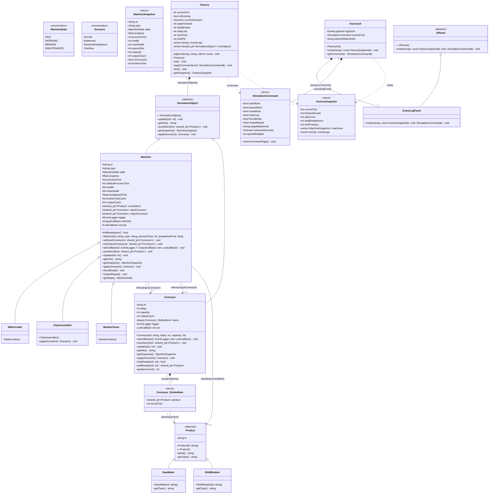
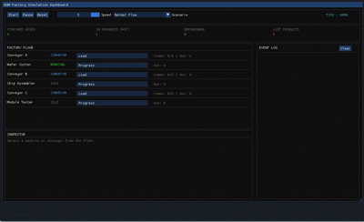
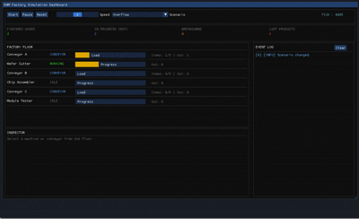

# Factory Simulation

GIST OOPS Final Project (2026-1)

## Project Structure

- src/ : source code
- build/ : executable files
- UML-diagram.pdf : UML class diagram

## Description

This project simulates a factory production line using object-oriented design principles.

Features:
- Factory simulation
- Machine state management
- Event logging
- Multiple simulation scenarios
- Interactive UI

## UML Diagram

## UI Simulation

### 1. Normal Scenario

The Normal Scenario demonstrates the standard production flow of the RAM manufacturing process. Products move through each stage of the production line without bottlenecks or machine failures, showing the intended behavior of the system.

---

### 2. Overflow Scenario

The Overflow Scenario demonstrates how the factory behaves when products are generated faster than they can be processed. Queues begin to fill, bottlenecks appear, and products may be lost due to capacity limitations.

---

